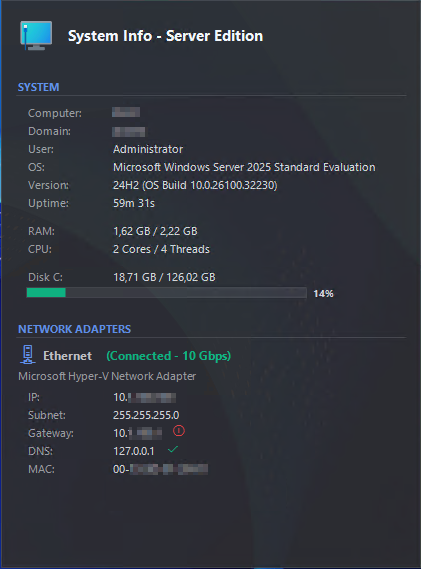

# System Info

**Version 2.0.26.3**
© 2026 Miloch

A lightweight Windows system tray application that provides comprehensive network and system information at a glance.


## Screenshot



## Features

### System Information
- **Computer Name** - Display computer hostname
- **Domain/Workgroup** - Shows full domain name (FQDN) or workgroup
- **Logged-in User** - Current user account
- **Operating System** - OS edition, version, and build number
- **System Uptime** - Formatted uptime (days, hours, minutes)
- **RAM Usage** - Total and used memory with visual display
- **Disk Space (C:\)** - Disk usage with color-coded progress bar
  - Green: < 70% used
  - Yellow: 70-85% used
  - Red: > 85% used

### Network Information
Displays detailed information for both **Ethernet** and **Wi-Fi** adapters:

- **Connection Status** - Connected, Disconnected, or Disabled
- **Link Speed** - Connection speed (e.g., 1 Gbps, 100 Mbps)
- **IP Address** - IPv4 address
- **Subnet Mask** - Network subnet mask
- **Gateway** - Default gateway with ping latency
  - ✓ Green: < 20ms (excellent)
  - ✓ Yellow: 20-50ms (good)
  - ✓ Red: > 50ms (slow)
  - ⓘ Red: Unreachable
- **DNS Servers** - All configured DNS servers with reachability check
  - ✓ Green: DNS reachable on port 53
  - ⓘ Red: DNS not reachable
- **MAC Address** - Physical adapter address

### User Interface
- **System Tray Icon** - Minimalist background operation
- **Mouse-over Tooltip** - Automatic information display on hover
- **Auto-refresh** - Updates every 10 seconds
- **Dark Theme** - Modern dark interface with color-coded indicators
- **Smooth Animations** - Fade-in/fade-out effects

## System Requirements

- **Operating System**: Windows 10 (1809) or later, Windows 11, Windows Server 2019+
- **Framework**: .NET 8.0 Runtime (self-contained - included in executable)
- **Permissions**: Standard user (no administrator rights required)

## Installation

1. Download `SystemInfo.exe` from the releases
2. Place the executable in your desired location
3. Ensure the `icons` folder is in the same directory as the executable
4. Run `SystemInfo.exe`

### Optional: Autostart
To run System Info automatically at Windows startup:
1. Press `Win + R`
2. Type `shell:startup` and press Enter
3. Create a shortcut to `SystemInfo.exe` in the opened folder

## Usage

### Starting the Application
- Double-click `SystemInfo.exe`
- The application will minimize to the system tray
- Look for the network icon in the system tray (notification area)

### Viewing Information
- **Hover** your mouse over the tray icon to see the information tooltip
- The tooltip will appear after ~800ms and auto-hide after 15 seconds
- Moving the mouse away will hide the tooltip immediately

### Context Menu Options
Right-click the tray icon to access:
- **Refresh Now** - Manually update network and system information
- **About** - View version and license information
- **Exit** - Close the application

## Technical Details

### Technologies Used
- **Framework**: .NET 8.0 (C#)
- **UI**: Windows Forms
- **Graphics**: GDI+ with anti-aliasing
- **Network**: System.Net.NetworkInformation
- **System Info**: WMI (Windows Management Instrumentation)

### Network Checks
- **Gateway Ping**: ICMP ping with 1-second timeout
- **DNS Reachability**: TCP connection test on port 53 with 1-second timeout

### Performance
- **Startup Time**: < 1 second
- **Memory Usage**: ~15-20 MB
- **CPU Usage**: Minimal (< 1% during updates)
- **Update Interval**: 10 seconds (configurable in code)

## Building from Source

### Prerequisites
- Visual Studio 2022 or later / VS Code with C# extension
- .NET 8.0 SDK

### Build Steps
```bash
# Clone or download the repository
cd "System Info"

# Restore dependencies
dotnet restore

# Build release version
dotnet build -c Release

# Publish self-contained executable
dotnet publish -c Release -r win-x64 --self-contained true -p:PublishSingleFile=true -p:IncludeNativeLibrariesForSelfExtract=true
```

The compiled executable will be in:
```
bin\Release\net8.0-windows10.0.17763.0\win-x64\publish\SystemInfo.exe
```

## Project Structure

```
System Info/
├── AboutForm.cs                  # About dialog
├── AdapterTooltipForm.cs        # Main tooltip display form
├── NetworkAdapterInfo.cs        # Network adapter data model
├── NetworkAdapterManager.cs     # Network adapter logic
├── Program.cs                   # Application entry point
├── SystemInfo.cs                # System information gathering
├── TrayApplicationContext.cs    # System tray context
├── app.manifest                 # Application manifest (no elevation)
├── SystemInfo.csproj        # Project file
├── SystemInfo.sln           # Solution file
├── config/
│   └── about.xml                # About dialog configuration (editable)
├── icons/                       # Application icons
│   └── Appicon.ico
└── README.md                    # This file
```

## Configuration

### About Dialog (config/about.xml)
Edit `config/about.xml` to customize the About dialog without recompiling:
```xml
<?xml version="1.0" encoding="utf-8"?>
<AboutConfig>
  <Description>Your custom description text here.</Description>
  <SupportEmail>display@example.com</SupportEmail>
  <SupportEmailAddress>mailto:actual@example.com</SupportEmailAddress>
</AboutConfig>
```
If the file is missing or invalid, the application uses built-in default values.

### Changing Update Interval
Edit `TrayApplicationContext.cs`, line 57:
```csharp
updateTimer = new Timer
{
    Interval = 10000  // Change to desired milliseconds
};
```

### Modifying Disk Space Thresholds
Edit `AdapterTooltipForm.cs`, method `DrawProgressBar`:
```csharp
if (percentage < 70)          // Green threshold
    progressColor = Color.FromArgb(16, 185, 129);
else if (percentage < 85)     // Yellow threshold
    progressColor = Color.FromArgb(251, 191, 36);
else
    progressColor = Color.FromArgb(239, 68, 68);  // Red
```

### Modifying Gateway Latency Thresholds
Edit `AdapterTooltipForm.cs`, method `DrawInfoLineWithLatency`:
```csharp
if (latency < 20)             // Green threshold
    latencyColor = Color.FromArgb(16, 185, 129);
else if (latency < 50)        // Yellow threshold
    latencyColor = Color.FromArgb(251, 191, 36);
else
    latencyColor = Color.FromArgb(239, 68, 68);  // Red
```

## License

**FREEWARE**

This software is provided free of charge for personal and commercial use. You may use, copy, and distribute this software without restriction.

THE SOFTWARE IS PROVIDED "AS IS", WITHOUT WARRANTY OF ANY KIND, EXPRESS OR IMPLIED. IN NO EVENT SHALL THE AUTHOR BE LIABLE FOR ANY CLAIM, DAMAGES OR OTHER LIABILITY ARISING FROM THE USE OF THIS SOFTWARE.

## Version History

### Version 2.0.26.3 (Current)
- Hyper-V and VMware network adapters are now displayed
- About dialog description and email are configurable via `config/about.xml`
- Version number is now read from assembly metadata

### Version 2.0.26.1
- Display all configured DNS servers (not just the primary)
- Dynamic height calculation for multiple DNS entries
- Improved adapter filtering (excludes WLAN, Bluetooth, Virtual adapters)

### Version 1.0 Beta
- Gateway ping with latency measurement and color-coded display
- DNS reachability check (Port 53 TCP)
- Link speed display for network adapters
- RAM usage information with formatted display
- Disk space (C:\) with color-coded progress bar
- System uptime display
- Full domain name (FQDN) support for domains
- About dialog with version and license information
- No administrator rights required for read-only operations
- Dark theme UI with smooth animations
- Auto-refresh every 10 seconds

## Support & Contact

For issues, questions, or suggestions:
- **Author**: Miloch
- **Year**: 2026
- **License**: Freeware

## Acknowledgments

- Built with .NET 8.0 and Windows Forms
- Uses Segoe UI and Segoe MDL2 Assets fonts
- Network information via Windows Management Instrumentation (WMI)
- Inspired by the need for a simple, non-intrusive system information tool
